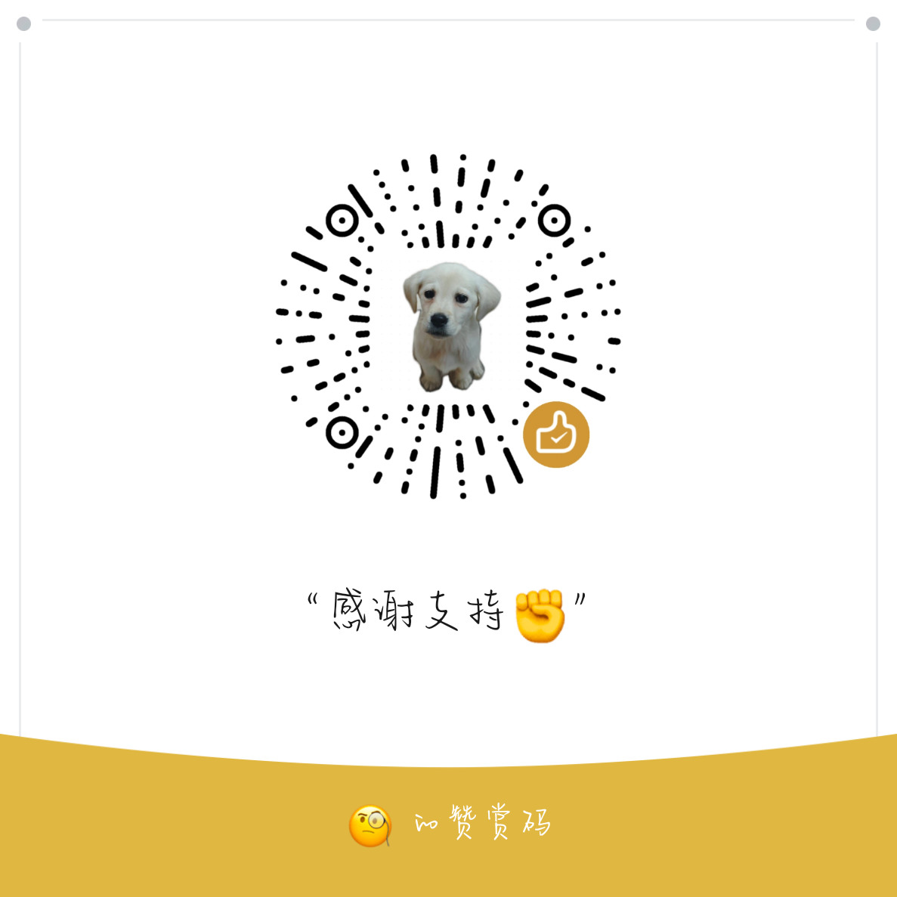

# OpenClaude - Claude Code + OpenAI API 适配器

🚀 **将 Anthropic Claude 的 API 接口封装为 OpenAI 兼容格式，为 Claude-Code 模型提供开箱即用的 OpenAI API 适配层，无缝接入现有生态**

## 🎬 演示视频

<div align="center">

[](blog/images/demo.mp4)

</div>

> 📺 完整演示了 OpenClaude 的安装、配置和使用流程

## 🎯 项目初衷

本项目通过深度魔改 claude-code 1.0.72 版本，**彻底破除了所有限制壁垒**：

### 🔓 突破的限制
- **🚫 登录认证** - 移除复杂的 OAuth 流程和 token 验证
- **🌍 区域限制** - 绕过地理位置检测和访问控制  
- **🔒 WebFetch 服务端限制** - 解除网络请求的服务端约束, 解除http请求限制
- **🔍 WebSearch 功能限制** - 开放网络搜索能力的完整访问

### 📚 为什么要做这个项目？

这个项目主要是出于对 claude-code 内部实现的好奇，以及对各种使用限制的不满。通过研究其架构，我逐步移除了认证检查、区域限制等约束代码。

额外提到 WebSearch 功能 - 考虑到大部分模型（尤其是本地部署的）都不具备联网搜索能力，我重新设计了服务端的 WebSearch 实现方案：

**WebSearch 技术方案：**
- **搜索引擎**：目前使用阿里云开放搜索的API
- **实现架构**：检索 + 大模型总结的二阶段处理
- **API 文档**：https://help.aliyun.com/zh/open-search/search-platform/developer-reference/web-search
- **未来规划**：计划自建搜索服务，减少对外部依赖
这样设计的好处是即使是完全离线的模型，也能通过我们的适配层获得联网搜索能力。同时，通过大模型对搜索结果的二次处理，可以提供更精准和相关的答案。

！！！狗头保命，本人用的是正版claude max的哈...做这个工作纯粹为了使用mcp技术将一个纯离线版claude打造为一个正版claude code的科研助理，目标让正版claude-code同时驱动一大堆破解版claude-code助理并发干活，让claude-code借住claude-code的能力再上一层楼。

## 🌟 项目特性

- ✅ **OpenAI API 完全兼容** - 支持现有 OpenAI SDK 和工具
- 🎯 **Claude-Code 专属优化** - 针对 Claude-Code 模型深度定制
- 🔧 **魔改 claude-code 1.0.72** - 删除登录认证、token续签和区域限制
- 🌐 **无需科学上网** - 本地化部署，直接使用
- ⚡ **即插即用** - 最小化配置，快速启动
- 🛡️ **灵活配置** - 支持环境变量自定义服务地址

## 🏗️ 架构说明

本项目包含两个核心组件：

1. **API 适配服务** (`src/index.ts`) - 提供 OpenAI 兼容的 HTTP API
2. **魔改 Claude CLI** (`claude`) - 修改版 claude-code 客户端，默认连接到本地服务

```
┌─────────────────┐    HTTP API     ┌──────────────────┐    Anthropic API    ┌─────────────────┐
│   Your App      │ ──────────────> │  OpenClaude      │ ─────────────────> │  Claude Models  │
│  (OpenAI SDK)   │    OpenAI格式   │   Adapter        │    Claude格式       │   (Anthropic)   │
└─────────────────┘                 └──────────────────┘                     └─────────────────┘
```

## 🚀 快速开始

### 环境要求

- Node.js 18+
- npm 或 yarn

### 1. 安装依赖

```bash
npm install
# 或
yarn install
```

### 2. 配置环境变量

创建 `.env` 文件：

```env
# 必需 - OpenAI API Key
OPENAI_API_KEY=your_openai_api_key_here

# 可选 - 自定义 OpenAI Base URL
OPENAI_BASE_URL=https://api.openai.com/v1

# 可选 - 服务端口
PORT=3000

# 可选 - 模型配置文件路径
MODEL_CONFIG_PATH=./models.json
```

### 3. 启动服务

```bash
# 开发模式
npm run dev

# 生产模式
npm run build
npm start

# 或直接运行
node dist/app.js
```

### 4. 使用魔改 Claude CLI

```bash
# 启动 claude-code 客户端
./claude

# 如果出现登录提示，直接回车跳过所有步骤
```

## 📖 API 使用

### 模型列表

```bash
curl http://localhost:3000/v1/models
```

### 发送消息

```bash
curl -X POST http://localhost:3000/v1/messages \
  -H "Content-Type: application/json" \
  -H "Authorization: Bearer your-api-key" \
  -d '{
    "model": "claude-3-5-sonnet-20241022",
    "messages": [
      {
        "role": "user",
        "content": "Hello, Claude!"
      }
    ],
    "max_tokens": 1000
  }'
```

## 🔧 高级配置

### 自定义模型配置

复制 `models.example.json` 为 `models.json` 并根据需要修改：

```json
{
  "models": [
    {
      "openaiModelName": "gpt-4",
      "claudeModelName": "claude-3-5-sonnet-20241022",
      "maxTokens": 4096,
      "description": "Claude 3.5 Sonnet"
    }
  ]
}
```

### 环境变量详解

| 变量名 | 描述 | 默认值 | 必需 |
|--------|------|--------|------|
| `OPENAI_API_KEY` | OpenAI API 密钥 | - | ✅ |
| `OPENAI_BASE_URL` | OpenAI API 基础URL | `https://api.openai.com/v1` | ❌ |
| `PORT` | 服务端口 | `3000` | ❌ |
| `MODEL_CONFIG_PATH` | 模型配置文件路径 | `./models.json` | ❌ |
| `ANTHROPIC_BASE_URL` | Claude CLI 使用的自定义API地址 | `http://localhost:3000` | ❌ |

## 🔌 集成示例
### JavaScript/Node.js

```javascript
import Anthropic from '@anthropic-ai/sdk';

const client = new Anthropic({
  baseURL: 'http://localhost:3000'
});

async function main() {
  console.log('Claude with Web Search (Streaming)');
  console.log('==================================');

  // Create a stream with web search enabled
  const stream = client.messages
    .stream({
      model: 'claude-sonnet-4-20250514',
      max_tokens: 1024,
      messages: [
        {
          role: 'user',
          content: "What's the weather in New York?",
        },
      ],
      tools: [
        {
          name: 'web_search',
          type: 'web_search_20250305',
        },
      ],
    })
    .on('text', (text) => {
      // Print text as it arrives
      process.stdout.write(text);
    })
    .on('streamEvent', (event) => {
      // Track when web search is being used
      if (event.type === 'content_block_start' && event.content_block.type === 'web_search_tool_result') {
        process.stdout.write('\n[Web search started...]');
      }
    });

  // Wait for the stream to complete
  const message = await stream.finalMessage();

  console.log('\n\nFinal usage statistics:');
  console.log(`Input tokens: ${message.usage.input_tokens}`);
  console.log(`Output tokens: ${message.usage.output_tokens}`);

  if (message.usage.server_tool_use) {
    console.log(`Web search requests: ${message.usage.server_tool_use.web_search_requests}`);
  } else {
    console.log('No web search requests recorded in usage');
  }

  // Display message content types for debugging
  console.log('\nMessage Content Types:');
  message.content.forEach((block, i) => {
    console.log(`Content Block ${i + 1}: Type = ${block.type}`);
  });

  // Show full message for debugging
  console.log('\nComplete message structure:');
  console.dir(message, { depth: 4 });
}

main().catch(console.error);
```

## 📁 项目结构

```
openclaude/
├── src/
│   ├── adapters/           # API 适配器
│   ├── config/            # 配置管理
│   ├── routes/            # 路由处理
│   ├── types/             # 类型定义
│   └── utils/             # 工具函数
├── claude                 # 魔改的 claude-code 客户端
├── dist/                  # 编译输出
├── models.json           # 模型配置
└── package.json
```

## 🔍 支持的端点

| 端点 | 方法 | 描述 |
|------|------|------|
| `/v1/models` | GET | 获取可用模型列表 |
| `/v1/models/:id` | GET | 获取特定模型信息 |
| `/v1/messages` | POST | 发送消息 (Claude 格式) |
| `/v1/chat/completions` | POST | 发送消息 (OpenAI 格式) |
| `/health` | GET | 服务健康检查 |

## 🛠️ 开发

### 启动开发服务器

```bash
npm run dev
```

### 构建项目

```bash
npm run build
```

### 项目依赖

- **Express.js** - Web 框架
- **@anthropic-ai/sdk** - Anthropic Claude SDK
- **OpenAI SDK** - OpenAI API 客户端
- **TypeScript** - 类型安全
- **CORS** - 跨域支持

## 🧪 测试验证

项目包含完整的示例代码，可以验证所有功能正常工作：

### 运行示例

```bash
# 这里的ANTHROPIC_API_KEY随便填即可
# 基础消息示例
ANTHROPIC_API_KEY=test-key npx ts-node examples/demo.ts
# 流式响应示例
ANTHROPIC_API_KEY=test-key npx ts-node examples/streaming.ts
# 工具使用示例
ANTHROPIC_API_KEY=test-key npx ts-node examples/tools.ts
# 思维模式示例
ANTHROPIC_API_KEY=test-key npx ts-node examples/thinking.ts
# 网络搜索示例
ANTHROPIC_API_KEY=test-key npx ts-node examples/web-search.ts
```

### 已验证功能

✅ **基础消息传递** - 标准 Claude API 调用  
✅ **流式响应** - 实时 token 输出  
✅ **工具调用** - Function calling 支持  
✅ **思维模式** - Thinking 模式响应  
✅ **批处理** - 批量消息处理  
✅ **网络搜索** - Web search 工具集成  
✅ **取消机制** - 流式请求中断  
✅ **Token 计数** - 精确 token 统计  

### 完整的示例集

| 示例文件 | 功能描述 | 验证状态 |
|---------|---------|---------|
| `demo.ts` | 基础消息示例 | ✅ 通过 |
| `streaming.ts` | 流式响应 | ✅ 通过 |
| `raw-streaming.ts` | 原始流处理 | ✅ 通过 |
| `tools.ts` | 工具调用 | ✅ 通过 |
| `tools-streaming.ts` | 流式工具调用 | ✅ 通过 |
| `thinking.ts` | 思维模式 | ✅ 通过 |
| `thinking-stream.ts` | 流式思维 | ✅ 通过 |
| `web-search.ts` | 网络搜索 | ✅ 通过 |
| `web-search-stream.ts` | 流式搜索 | ✅ 通过 |
| `cancellation.ts` | 请求取消 | ✅ 通过 |
| `count-tokens.ts` | Token 计数 | ✅ 通过 |
| `batch-results.ts` | 批处理结果 | ✅ 通过 |
| `mcp.ts` | MCP 协议支持 | ✅ 通过 |

所有示例都已配置为使用本地适配服务 (`localhost:3000`)，确保完全兼容性。

## ❓ 常见问题

### Q: 为什么需要 OPENAI_API_KEY？

A: 本项目作为适配层，需要 OpenAI API Key 来访问底层模型服务。你可以配置不同的 `OPENAI_BASE_URL` 来使用其他兼容服务。

### Q: 如何配置自定义服务地址？

A: 设置环境变量 `ANTHROPIC_BASE_URL=http://your-custom-url:port`

### Q: 魔改 Claude CLI 有什么变化？

A: 主要删除了：
- 登录认证流程
- Token 自动续签
- 区域访问限制
- 默认连接地址改为 localhost:3000
- claude-code魔改部分的细节就不透露太多了，直接用就好了。

### Q: 如何验证服务是否正常工作？

A: 可以运行 `examples/` 目录下的任意示例进行测试：
```bash
ANTHROPIC_API_KEY=test-key npx ts-node examples/demo.ts
```

## 📄 许可证

本项目基于原始 claude-code 进行修改，仅供学习和研究使用。

## 🤝 贡献

欢迎提交 Issue 和 Pull Request！

## 💝 支持项目

如果这个项目对你有帮助，欢迎请作者喝杯咖啡！你的支持是我持续改进和维护这个项目的动力。

### 微信赞赏

<div align="center">

<p><em>扫码请作者喝咖啡 ☕</em></p>
</div>

感谢每一位支持者的慷慨！你们的鼓励让开源精神得以延续。🙏

### 其他支持方式
- ⭐ 给项目点个 Star
- 🐛 提交 Issue 反馈
- 🔧 贡献代码改进
- 📢 分享给更多需要的朋友

---

**⚡ 让 Claude 模型无缝融入你的 OpenAI 生态系统！**